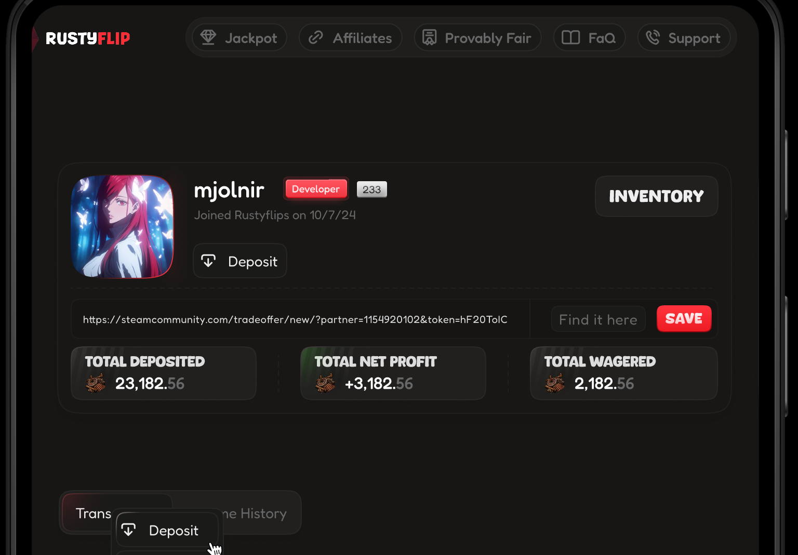

## **RustyFlip**  
RustyFlip is a cutting-edge, blockchain-powered gaming platform inspired by the classic RustyPot experience. It leverages Web3 technologies to provide users with secure, transparent, and engaging gaming features, including customizable coinflip matches, tiered jackpot rooms, progressive jackpots, and cryptocurrency staking.  

This project supports multiple blockchain networks, a wide array of tokens, and popular wallets, making it accessible to gamers and crypto enthusiasts worldwide.
  

---

### **Table of Contents**  
1. [Core Features](#corefeatures)  
2. [Supported Blockchains](#supported-blockchains)  
3. [Supported Tokens](#supported-tokens)  
4. [Supported Wallets](#supported-wallets)  
5. [Technological Stack](#technological-stack)  
6. [Installation](#installation)  
7. [Usage](#usage)  
8. [Contributing](#contributing)  
9. [Demo](#demo)   

---

### **Core Features**  
- **Customizable Coinflip**:  
  - Set custom odds, wager limits, or create invite-only matches.  

- **Tiered Jackpot Rooms**:  
  - Beginner, Intermediate, and High-Roller rooms tailored for different player levels.  

- **Progressive Jackpot**:  
  - A dynamic jackpot pool that grows with each game played.  

- **Staking Rewards**:  
  - Stake supported cryptocurrencies to earn passive rewards.  

- **Multi-Blockchain Support**:  
  - Operates across EVM and non-EVM chains, offering unparalleled accessibility.  

- **Provably Fair Gaming**:  
  - Built on transparent smart contracts, ensuring fairness and trust.  

---

### **Supported Blockchains**  
RustyFlip operates on a wide range of blockchain networks:  

#### **EVM-Compatible Chains**  
- Ethereum  
- Binance Smart Chain (BNB)  
- Polygon  
- Optimism  
- Avalanche  
- Arbitrum  
- Fantom  
- Base  
- zkSync Era  
- Klaytn  

#### **Non-EVM Chains**  
- Bitcoin  
- Tron  
- Solana  
- Internet Computer  
- Cardano  

---

### **Supported Tokens**  
RustyFlip supports a broad range of cryptocurrencies, including:  
- ETH, BNB, BTC, USDT, USDC, TRX, ARB, XRP  
- MATIC, SHIB, DAI, AVAX, FTM, OP, ICP, SOL  
- KLAY, ADA, LINK, DYDX, JUP, WBTC, BUSD, and more.  

---

### **Supported Wallets**  
RustyFlip integrates with popular crypto wallets, providing seamless access and secure transactions:  
- **EVM-Compatible Wallets**:  
  - MetaMask, Trust Wallet, Coinbase Wallet, Binance Wallet, Coin98, SafePal, TokenPocket, MathWallet.  

- **Non-EVM Wallets**:  
  - Phantom Wallet (for Solana).  

---

### **Technological Stack**  
- **Backend**: Node.js  
- **Frontend**: Next.js  
- **Database**: MongoDB  
- **Smart Contracts**: Solidity  

---

### **Installation**  

#### **Prerequisites**  
Ensure you have the following installed:  
- [Node.js](https://nodejs.org/)  
- [npm](https://www.npmjs.com/) or [yarn](https://yarnpkg.com/)  
- [MongoDB](https://www.mongodb.com/)  

#### **Steps**  
1. Clone the repository:  
   ```bash  
   git clone https://bitbucket.org/nazariicasino/version1.24-public.git  
   cd version1.24-public
   ```  

2. Install dependencies:  
   ```bash  
   npm install  
   ```  

3. Set up environment variables:  
   Create a `.env` file in the project root and configure it with your API keys, database URI, and other settings.  

4. Start the development server:  
   ```bash  
   npm run dev  
   ```  

---

### **Usage**  
Once the development server is running:  
- Access the platform at `http://localhost:3000`.  
- Interact with features like coinflip, jackpot rooms, and staking rewards.  

---

### **Contributing**  
We welcome contributions! Follow these steps:  
1. Fork the repository.  
2. Create a new feature branch:  
   ```bash  
   git checkout -b feature/your-feature  
   ```  
3. Commit your changes:  
   ```bash  
   git commit -m "Add your feature"  
   ```  
4. Push to the branch:  
   ```bash  
   git push origin feature/your-feature  
   ```  
5. Create a pull request.  

---

### **Demo**

- Previous Version : https://rustypot.com/
- Next Version : https://www.rustyflip.com/